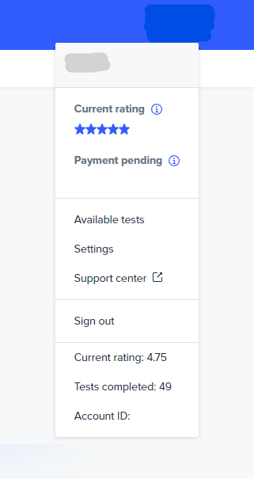

# ReturnUTRating - not yet working

You will need something like Violentmonkey or similar to install this script 
<a href="https://github.com/pacjo/ReturnUTRating/raw/main/Return%20UT%20score.user.js">Install</a>

## Development

current rating can be found in dashbord html code (screenshot below)

you can find yours by opening view-source tab and searching for `tester_quality_rating`